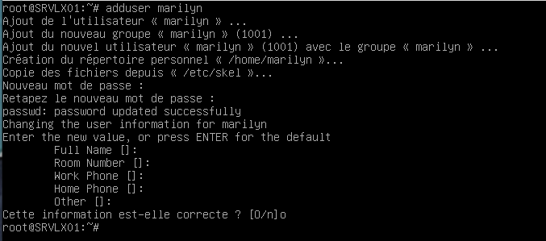
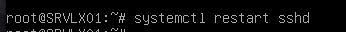
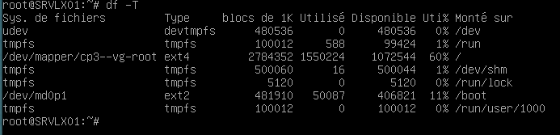

# Exercice 2:Manipulations pratiques sur VM Linux

## Partie 1:Gestion des utilisateurs

 - Q.2.1.1 Sur le serveur, créer un compte pour ton usage personnel.
  
   

 - Q.2.1.2 Quelles préconisations proposes-tu concernant ce compte ?

    - Minimum 12 caractères.
    - Mettre des majuscules, minuscules, chiffres, et caractères spéciaux
    - Ne pas donner des droits sudo
    - Utiliser une clé SSH pour l'accès distant

## Partie 2 : Configuration de SSH

 - Q.2.2.1 Désactiver complètement l'accès à distance de l'utilisateur root.

  
  
  

- Q.2.2.2 Autoriser l'accès à distance à ton compte personnel uniquement.
  
 

 

- Q.2.2.3 Mettre en place une authentification par clé valide et désactiver l'authentification par mot de passe
  
 

 
 
## Partie 3 : Analyse du stockage

- Q.2.3.1 Quels sont les systèmes de fichiers actuellement montés ?
- 
   

- Q.2.3.2 Quel type de système de stockage ils utilisent ?
  
 
 
- Q.2.3.3 Ajouter un nouveau disque de 8,00 Gio au serveur et réparer le volume RAID

- Q.2.3.4 Ajouter un nouveau volume logique LVM de 2 Gio qui servira à héberger des sauvegardes. Ce volume doit être monté automatiquement à chaque démarrage dans l'emplacement par défaut : /var/lib/bareos/storage.

- Q.2.3.5 Combien d'espace disponible reste-t-il dans le groupe de volume ?

## Partie 4 : Sauvegardes

- Q.2.4.1 Expliquer succinctement les rôles respectifs des 3 composants bareos installés sur la VM.

   - Le Director gère les sauvegardes.
   - Le Storage Daemon reçoit et stocke les données.
   - Le File Daemon lit les données sauvegarder.

## Partie 5 : Filtrage et analyse réseau

- Q.2.5.1 Quelles sont actuellement les règles appliquées sur Netfilter ?

- Q.2.5.2 Quels types de communications sont autorisées ?

- Q.2.5.3 Quels types sont interdit ?

- Q.2.5.4 Sur nftables, ajouter les règles nécessaires pour autoriser bareos à communiquer avec les clients bareos potentiellement présents sur l'ensemble des machines du réseau local sur lequel se trouve le serveur.

## Partie 6 : Analyse de logs

- Q.2.6.1 Lister les 10 derniers échecs de connexion ayant eu lieu sur le serveur en indiquant pour chacun :

    La date et l'heure de la tentative
    L'adresse IP de la machine ayant fait la tentative
